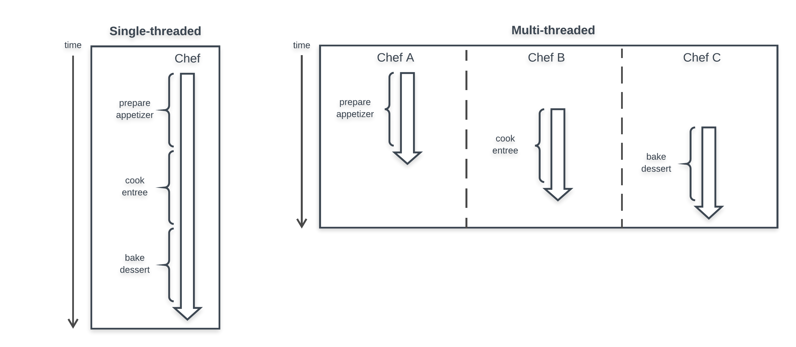

# "I heard you like to run code so I made it so that you could run code while you run code" - JavaScript

## The `Event` `Loop`

We've been using the event loop this whole time!

Made of two parts:

- `Call Stack`
  - Events that are **_currently happening_**
- `Message Queue`
  - Events that are **_waiting to happen_**

## A New Data Structure Approaches....QUEUE!

- `Stack`
  - First In, Last Out `&&` Last In, First Out
  - Like a stack of boxes
- `Queue`
  - First In, First Out `&&` Last In, Last Out
  - Like a line at the grocery store

### Wait what's the `Call Stack` again?

- JavaScript's way to track the order of execution for function calls
- As we call functions, they are pushed onto the call stack
  - These are known as `stack frames`
- When a function evaluates, the frame on the top of the stack is popped off the stack

### What about the `Message Queue`?

- Since JS is `single threaded`, it can't process more than one task at a time - no interruptions allowed!
- Instead, any new tasks (`events`) have to wait in line
  - The `Message Queue` is the line!
- New events are added to the back of the line (`enqueue`)
- Events are removed from the front of the line (`dequeue`)

### Why do we even need a `Message Queue`? Doesn't the `Call Stack` keep track of multiple events?

- The `Call Stack` can only keep track of `synchronous` tasks
- The `Message Queue` handles `asynchronous` tasks

---

# `Threads` and `Synchronous` vs `Asynchronous`

## Threading

In a single-threaded environment, only one command can be processed at a time.

In a multi-threaded environment, multiple commands can be processed at the same
time.



### **_JavaScript is Single Threaded_**...unless? 😏😏😏

JavaScript is a single threaded language that can be `non-blocking`

- Can allow `synchronous` code to keep running while `asynchronous` code executes
- This provides multi-threaded functionality
  - But **_JS IS NOT MULTI-THREADED_**

## Okay hold on, what is `synchronous` code?

- Any code that runs "in order"
  - Handled by the `Call Stack`
  - Everything up to this point has been `synchronous`
- There is an **_inherent order_** among the commands
  - This order of execution is **_guaranteed_**

## Then what the heck is `asynchronous` code???

- Any code that runs "without order"
  - Handled by the `Message Queue` (with some help)
  - `Events` in JS are handled `asynchronously`
  - Most interactions we have with a website are `asynchronous`
- There is **_NOT_** a guaranteed order that commands are executed

### `Asynchronous` is the opposite of `Synchronous`

---

## Now finally, how the `Message Queue` works

- When async function is called in your program, its handed over to the `JavaScript Runtime`
  - AKA `C++ land`
    - This is where the function is actually ran
  - That way, JS can keep running synchronous code
  - Many different async functions can be running at once
- When the runtime is done running the async code, it `enqueues` a message to the message queue
- When the call stack finishes its last stack frame, the next message is dequeued, added to the call stack, and processed

### What does an `event` look like in the real world?

- An event can be many different things, but think of the chain reaction when clicking "submit" on a websites' form
  - The button click causes **_Function One_** to run
  - **_Function One_** will validate the form data, then pass it to **_Function Two_**
  - **_Function Two_** will send the data to the database, which is received by **_Function Three_**
  - **_Function Three_** saves the data in the database, and sends back a confirmation
  - All the while, the user can continue to use the website!

## `setTimeout()` and `setInterval()`

These functions take two mandatory arguments:

- A callback function
  - The callback will be called asynchronously
  - The code in the callback will still execute synchronously
- A number representing time in milliseconds
- They can optionally take any number of extra arguments to pass to the callback

`setTimeout()` will run the callback **_after_** `num` milliseconds have passed

`setInterval()` will run the callback **_every_** `num` milliseconds

```js
const myCB = () => {
  console.log("Look");
  console.log("at");
  console.log("me");
  console.log("go!");
};

setTimeout(myCB, 2000);
setInterval(myCB, 2000);
```

## Ready to be tested? 😳

```js
// --------------- Problem 1 ---------------------------
console.log("one");
console.log("two");
console.log("three");

// --------------- Problem 2 ---------------------------
const foo = () => {
  console.log("two");
};

console.log("one");
foo();
console.log("three");

// --------------- Problem 3 ---------------------------
console.log("one");

setTimeout(() => {
  console.log("two");
}, 1500);

console.log("three");
```

## SetTimeout

```js
// --------------- Problem 1 ---------------------------
setTimeout(() => {
  console.log("time is up");
}, 1000);

console.log("end");

// --------------- Problem 2 ---------------------------
const foo = (a, b) => {
  console.log("time is up");
  console.log(`${a} ${b}`);
};

setTimeout(foo, 1000, "potato", "tomato");

console.log("end");

// --------------- Problem 3 ---------------------------
const foo = (a, b) => {
  console.log("time is up");
  console.log(`${a} ${b}`);
};

const res = setTimeout(foo, 1000, "potato", "tomato");
clearTimeout(res);
```

## SetInterval

```js
// --------------- Problem 1 ---------------------------
const foo = (a, b) => {
  console.log("time is up");
  console.log(`${a} ${b}`);
};

setInterval(foo, 1000, "potato", "tomato");

// --------------- Problem 2 ---------------------------
const foo = (a, b) => {
  console.log("time is up");
  console.log(`${a} ${b}`);
};

const interval = setInterval(foo, 1000, "potato", "tomato");
clearInterval(interval);

// --------------- Problem 3 ---------------------------
const intervalCount = (count, delay) => {
  const intervalObj = setInterval(() => {
    console.log("time is up");
    count--;

    if (count === 0) {
      clearInterval(intervalObj);
    }
  }, delay);
};

intervalCount(3, 500);
```